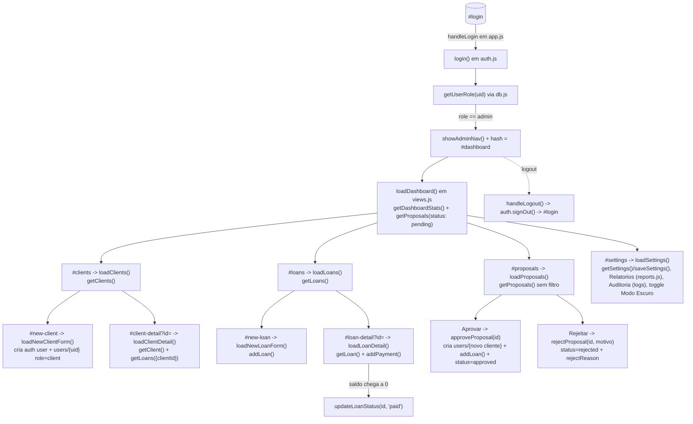
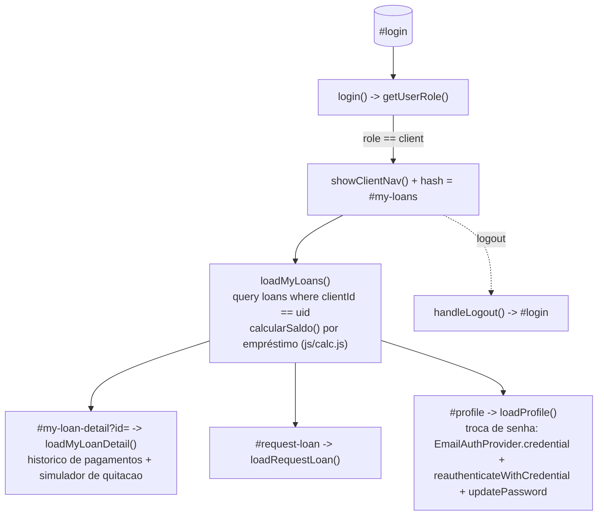
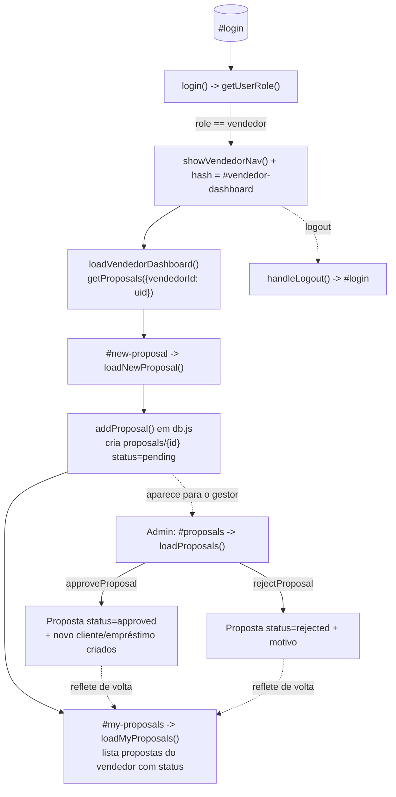

# Diagnóstico ponta a ponta — Jornadas por papel (CerraLoan)

O CerraLoan é um PWA de gestão de microcrédito (HTML/JS puro, roteamento por hash em
[js/app.js](../../js/app.js)) com três papéis: **admin/gestor**, **cliente** e **vendedor**.
Os dados vivem hoje num backend local ([js/offline-firebase.js](../../js/offline-firebase.js))
que imita a API do Firebase Auth/Firestore via `localStorage`, para permitir demonstração
100% offline antes da migração para um projeto Firebase real.

Este documento mapeia a jornada completa de cada papel usando os nomes reais de rotas e
funções do código, e registra os achados da verificação ponta a ponta (feita com
automação de navegador cobrindo viewport mobile e desktop, login/logout, CRUD de
clientes/empréstimos/pagamentos e o fluxo de propostas do vendedor).

## Papéis e rotas (fonte: `js/app.js`)

| Papel | Rotas exclusivas (`*_ROUTES`) | Home | Nav (`index.html`) |
|---|---|---|---|
| `admin` | `ADMIN_ROUTES`: `#dashboard`, `#clients`, `#new-client`, `#client-detail`, `#loans`, `#new-loan`, `#loan-detail`, `#settings`, `#proposals` | `#dashboard` | `#admin-nav` |
| `client` | `CLIENT_ROUTES`: `#my-loans`, `#my-loan-detail`, `#profile`, `#request-loan` | `#my-loans` | `#client-nav` |
| `vendedor` | `VENDEDOR_ROUTES`: `#vendedor-dashboard`, `#new-proposal`, `#my-proposals` | `#vendedor-dashboard` | `#vendedor-nav` |

A guarda de rota em `navigateTo()` bloqueia qualquer papel que tente acessar uma rota de
outro papel, redirecionando para `homeRouteForRole(role)`.

## Jornada: Administrador / Gestor

**Achado de fluxo:** ao aprovar uma proposta, `approveProposal()` cria um documento em
`users` com `role: 'client'` mas **sem conta de autenticação** (sem email/senha) — o
cliente aparece nas listagens do admin (`getClients()`) e nas estatísticas do dashboard,
mas não consegue logar no portal até o admin cadastrá-lo de novo pelo fluxo `#new-client`
com um email/senha. É um gap intencional para manter o fluxo de aprovação simples, mas
deve ser resolvido antes de ir para produção (ver seção de achados).

## Jornada: Cliente

**Achado de fluxo:** o saldo devedor é sempre recalculado no momento da consulta
(`calcularSaldo` em `js/calc.js`), nunca armazenado — confirmado nos testes: os valores
exibidos em `#my-loans` (ex.: R$ 968,00 para o empréstimo de Maria Souza, 35 dias a
0,6%/dia sem pagamentos) batem exatamente com o cálculo de juros simples sobre saldo
remanescente.

## Jornada: Vendedor

## Verificação executada

Rodada com Playwright (Chromium), servindo o app estaticamente, cobrindo:

- **Admin**: login, dashboard (contadores, gráfico de status, top devedores, alerta de
  empréstimo com >30 dias), `#proposals` (aprovar proposta pendente), `#clients` (cliente
  novo aparece após aprovação).
- **Cliente** (2 contas): login, `#my-loans` com um empréstimo ativo e um quitado
  simultaneamente, valores de saldo/juros/total pago corretos.
- **Vendedor**: login, dashboard de propostas, envio de nova proposta (`#new-proposal`),
  reflexo imediato em `#my-proposals`.
- **Guarda de rotas**: vendedor tentando `#dashboard` foi redirecionado para
  `#vendedor-dashboard`.
- **Layout**: viewport mobile (390×844) e desktop (1440×900, navegação lateral fixa) —
  sem alterações de comportamento entre eles.
- **Tema escuro**: dashboard, propostas e dashboard do vendedor com contraste corrigido.

Resultado: **0 erros de console/página** em todos os fluxos acima.

## Achados e recomendações

1. **Cliente sem login após proposta aprovada** (`js/db.js:approveProposal`) — cria o
   registro em `users` mas não uma conta de autenticação. Recomenda-se um botão
   "Ativar acesso do cliente" na tela de detalhe do cliente (`loadClientDetail`) que
   chame `createUserWithEmailAndPassword` posteriormente.
2. **Duplicação de lógica de cadastro de cliente**: `js/db.js:addClient()` não é usado —
   `window.loadNewClientForm` (em `js/views.js`) reimplementa a mesma lógica inline.
   Não é um bug, mas é duplicação a resolver num refactor futuro.
3. **Correções de contraste no modo escuro** já aplicadas nesta rodada
   (`css/style.css`): `.stat-value`, `.login-title` e `.btn-outline` usavam
   `var(--primary)`/`var(--secondary)`, escuros demais sobre fundo escuro.
4. **Layout desktop** adicionado via media query `@media (min-width: 900px)` em
   `css/style.css`, convertendo a barra inferior em navegação lateral fixa e expandindo
   grids de estatísticas para 4 colunas — mobile permanece inalterado.
